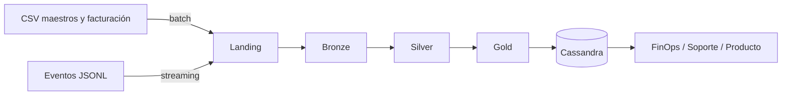

# Documento de diseño · Primera entrega

Minería de Datos II · ISTEA · 2C 2026

## 1. Problema

Ingestar, limpiar y publicar datos de clientes para **FinOps** (costos), **Soporte** (tickets y SLA) y **Producto** (uso).
- Eventos en casi tiempo real.
- Maestros y facturación en batch.

**Objetivos:** 8 fuentes en Bronze · `event_id` sin duplicados · inválidos a quarantine · 5 consultas desde Cassandra.

## 2. Las 5V

| V | Evidencia |
|---|---|
| Volumen | 43.200 eventos, 80 organizaciones, 60 días |
| Velocidad | 120 archivos JSONL (micro-lotes) |
| Variedad | CSV y JSONL, 8 fuentes, esquema v1 y v2 |
| Veracidad | nulos, `value` como texto, 216 costos negativos, 3 monedas |
| Valor | control de costos, SLA y uso |

## 3. Fuentes

| Fuente | 1 fila = | Filas | Frecuencia |
|---|---|---|---|
| customers_orgs | organización | 80 | diaria |
| users | usuario | 800 | diaria |
| resources | recurso | 400 | diaria |
| support_tickets | ticket | 1.000 | diaria |
| marketing_touches | interacción | 1.500 | diaria |
| nps_surveys | encuesta | 92 | mensual |
| billing_monthly | factura | 240 | mensual |
| usage_events | evento | 43.200 | streaming |

## 4. Arquitectura

**Patrón elegido: Lambda.** Batch para maestros y facturación (cambian poco). Streaming para eventos (llegan en micro-lotes). Herramienta: PySpark.

## 5. Data Lake

| Zona | Qué guarda | Formato | Partición |
|---|---|---|---|
| Landing | archivos originales, no se modifican | CSV / JSONL | — |
| Bronze | igual a la fuente + `ingest_ts` y `source_file` | Parquet | fecha |
| Silver | datos limpios, sin duplicados, v1/v2 unidos | Parquet | fecha y servicio |
| Gold | marts para FinOps, Soporte y Producto | Parquet | fecha |
| Quarantine | registros inválidos | Parquet | fecha |

**Promoción:** un dato pasa a la zona siguiente solo si cumple las reglas de calidad.

## 6. Flujo batch con MapReduce

**Objetivo:** costo diario por organización y servicio.

| Etapa | Qué hace |
|---|---|
| Map | por cada evento → clave `(org_id, fecha, service)`, valor `cost_usd_increment` |
| Shuffle | junta todos los eventos con la misma clave |
| Reduce | suma los costos de cada clave |
| Salida | `org_daily_usage_by_service` en Gold |

En Spark: `groupBy("org_id", "fecha", "service").agg(sum("cost_usd_increment"))`
